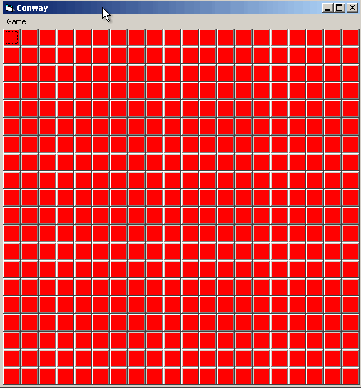

# Conway's Game of Life, retro edition

Here's another addition in the line of retro-styled games, implemented
using obsolete technology.  [Conway's Game of
Life](https://en.wikipedia.org/wiki/Conway%27s_Game_of_Life) isn't
really a game, but it's neat, and so we thought we'd implement it in
Visual Basic 6, the last version of the Visual Basic family of
languages that compiles to native 32-bit Windows executables.

## How does the game work?

Start the game.  Select a few cells to modify their state.  Click run
(that's Game > Run, or `C-r`).

